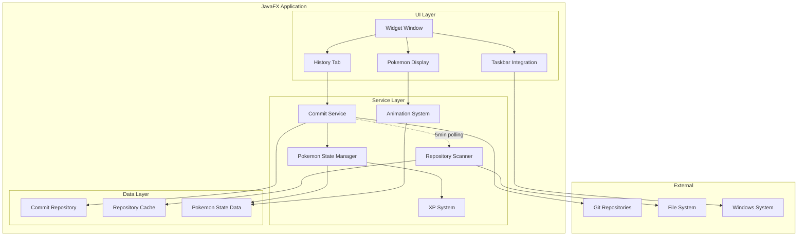
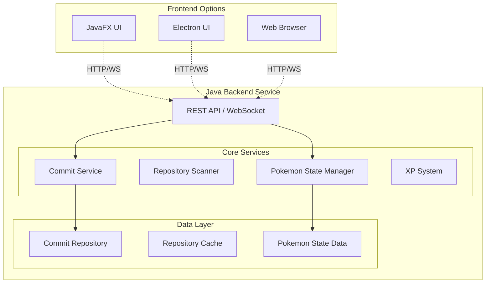

# Design Document

## Overview

The Pokemon-themed Tamagotchi Commit Tracker is a desktop widget application built with JavaFX that monitors Git repositories and displays a virtual Pokemon whose evolution and state reflect the user's coding activity. The application features 9 starter Pokemon with 3-stage evolution paths, where evolution is triggered by maintaining commit streaks and XP levels. The widget minimizes to the Windows taskbar and uses frame-based animations with PNG/JPEG sprites.

## Architecture

### Phase 1: JavaFX MVP Architecture


### Future Phase 2: Service-Oriented Architecture (Migration Ready)


## Components and Interfaces

### Widget Window (JavaFX Application)
- **Responsibility**: Main UI container with transparent background and drag functionality
- **Key Methods**:
  - `initialize()`: Set up transparent stage and initial pet display
  - `toggleMode()`: Switch between compact and expanded modes
  - `updatePetDisplay()`: Refresh pet animation based on current state
  - `enableDragging()`: Allow user to drag widget to new desktop position
  - `savePosition()`: Persist widget position for next startup
  - `restorePosition()`: Load saved widget position on startup
- **Properties**: Always-on-top, transparent background, draggable, minimizes to taskbar (not system tray)

### Pokemon Display Component
- **Responsibility**: Renders animated Pokemon with evolution stages
- **Key Methods**:
  - `playAnimation(AnimationType type)`: Display specific animation sequence using frame cycling
  - `updateState(PokemonState state)`: Change Pokemon's emotional/health state
  - `loadSpriteFrames(PokemonSpecies species, EvolutionStage stage)`: Load PNG/JPEG animation frames
  - `checkEvolutionRequirements()`: Evaluate if evolution criteria are met
  - `triggerEvolution(EvolutionStage newStage)`: Animate evolution sequence
- **Animation States**: Idle, Happy, Excited, Sleeping, Celebrating, Sad, Evolving
- **Starter Pokemon**: 9 choices 
- **Evolution Stages**: Basic → Stage 1 → Stage 2 (triggered by XP/streak milestones)

### Commit Service
- **Responsibility**: Orchestrates repository monitoring and data collection
- **Key Methods**:
  - `startMonitoring()`: Begin 5-minute polling cycle
  - `scanAllRepositories()`: Check all tracked repos for new commits
  - `processNewCommits(List<Commit> commits)`: Update pet state based on activity
- **Interfaces**: `CommitListener`, `RepositoryProvider`

### Repository Scanner
- **Responsibility**: Discovers and monitors Git repositories
- **Key Methods**:
  - `discoverRepositories()`: Find all Git repos on system
  - `validateRepository(Path path)`: Check if directory is valid Git repo
  - `getCommitsSince(Repository repo, LocalDateTime since)`: Fetch recent commits
- **Authentication**: Uses existing Git credential helpers and SSH keys

### Pokemon State Manager
- **Responsibility**: Determines Pokemon's emotional state and evolution progress
- **Key Methods**:
  - `calculateState(CommitHistory history)`: Analyze activity and determine state
  - `calculateXP(CommitHistory history)`: Convert commits to experience points
  - `getAnimationForState(PokemonState state)`: Map states to animation sequences
  - `checkEvolutionCriteria(XPLevel xp, StreakData streak)`: Determine if evolution requirements met
  - `updateHealthMetrics()`: Track long-term Pokemon wellness
- **State Factors**: Commit frequency, XP level, evolution stage, streak duration
- **Evolution Criteria**: 
  - Hatch from Egg: Maintain 4-day commit streak + reach XP threshold
  - Stage 1: Maintain 11-day commit streak + reach XP threshold
  - Stage 2: Maintain 22-day commit streak + reach higher XP threshold

## Data Models

### Commit
```java
public class Commit {
    private String hash;
    private String message;
    private String author;
    private LocalDateTime timestamp;
    private String repositoryName;
    private String repositoryPath;
}
```

### Repository
```java
public class Repository {
    private String name;
    private Path path;
    private String remoteUrl;
    private LocalDateTime lastScanned;
    private boolean isAccessible;
    private AuthenticationType authType;
}
```

### PokemonState
```java
public enum PokemonState {
    THRIVING,    // Regular commits, high activity
    HAPPY,       // Recent commits, good activity
    CONTENT,     // Moderate activity
    CONCERNED,   // Declining activity
    SAD,         // No recent commits
    NEGLECTED,   // Extended period without commits
    EVOLVING     // Currently undergoing evolution animation
}
```

### PokemonSpecies
```java
public enum PokemonSpecies {
    // Kanto Starters
    BULBASAUR, IVYSAUR, VENUSAUR,
    CHARMANDER, CHARMELEON, CHARIZARD,
    SQUIRTLE, WARTORTLE, BLASTOISE,
    
    // Johto Starters  
    CHIKORITA, BAYLEEF, MEGANIUM,
    CYNDAQUIL, QUILAVA, TYPHLOSION,
    TOTODILE, CROCONAW, FERALIGATR,
    
    // Hoenn Starters
    TREECKO, GROVYLE, SCEPTILE,
    TORCHIC, COMBUSKEN, BLAZIKEN,
    MUDKIP, MARSHTOMP, SWAMPERT
}
```

### EvolutionStage
```java
public enum EvolutionStage {
    EGG(0),        // Starting as egg
    BASIC(1),      // Hatched form (4+ day streak)
    STAGE_1(2),    // First evolution (11+ day streak)
    STAGE_2(3);    // Final evolution (22+ day streak)
    
    private final int level;
}
```

### XPSystem
```java
public class XPSystem {
    private int currentXP;
    private int level;
    private static final int[] EVOLUTION_XP_THRESHOLDS = {0, 200, 800, 2000}; // Egg, Basic, Stage1, Stage2
    
    public int calculateXPFromCommit(Commit commit) {
        // Base XP + bonuses for commit size, message quality, etc.
    }
}
```

### CommitHistory
```java
public class CommitHistory {
    private List<Commit> recentCommits;
    private Map<LocalDate, Integer> dailyCommitCounts;
    private LocalDateTime lastCommitTime;
    private int currentStreak;
    private double averageCommitsPerDay;
}
```

## Correctness Properties

*A property is a characteristic or behavior that should hold true across all valid executions of a system-essentially, a formal statement about what the system should do. Properties serve as the bridge between human-readable specifications and machine-verifiable correctness guarantees.*

### Property Reflection

After reviewing all testable properties from the prework analysis, several can be consolidated to eliminate redundancy:

- Properties 1.2 and 1.4 (UI state and sizing) can be combined into a comprehensive UI state property
- Properties 2.1, 2.2, and 2.3 (repository discovery and monitoring) can be unified into a repository tracking property
- Properties 3.1, 3.3, and 3.5 (polling behavior) can be combined into a polling consistency property
- Properties 4.1, 4.2, 4.3, and 4.4 (pet state reactions) can be consolidated into a pet state responsiveness property
- Properties 5.1, 5.2, and 5.3 (history display) can be unified into a commit display property

**Property 1: Repository Discovery and Monitoring**
*For any* file system containing Git repositories, the Repository Scanner should discover all valid repositories and continuously monitor them for new commits, regardless of authentication requirements
**Validates: Requirements 2.1, 2.2, 2.3, 2.4**

**Property 2: Polling Consistency**
*For any* running application instance, the Commit Tracker should poll all repositories at 5-minute intervals consistently, starting with an initial scan and continuing regardless of individual scan duration or network issues
**Validates: Requirements 3.1, 3.3, 3.5**

**Property 3: Pokemon State and Evolution Responsiveness**
*For any* commit activity pattern, the Pokemon should display appropriate emotional states and evolve when XP and streak thresholds are met, with smooth frame-based animations between states
**Validates: Requirements 4.1, 4.2, 4.3, 4.4, 4.5**

**Property 4: Commit Display Completeness**
*For any* set of commits across multiple repositories, the History Tab should display all commits with complete information (message, timestamp, repository, author) organized chronologically or by repository
**Validates: Requirements 5.1, 5.2, 5.3**

**Property 5: UI State Management**
*For any* widget mode transition, the UI should correctly show only appropriate components (pet-only in compact mode, full interface in expanded mode) while maintaining proper sizing constraints
**Validates: Requirements 1.2, 1.4**

**Property 6: Error Resilience**
*For any* repository access failure or authentication error, the system should continue monitoring accessible repositories while providing clear error messages and retry mechanisms
**Validates: Requirements 2.5, 7.3**

**Property 7: System Integration**
*For any* Windows system interaction, the widget should properly integrate with system tray, theme changes, window management, and credential storage using native Windows APIs
**Validates: Requirements 6.2, 6.3, 6.4, 6.5**

**Property 8: Authentication Security**
*For any* repository requiring authentication, the system should use existing Git credentials and SSH configurations without storing or exposing sensitive authentication data
**Validates: Requirements 7.1, 7.2, 7.4, 7.5**

## Error Handling

### Repository Access Errors
- **Git Authentication Failures**: Graceful degradation with clear error messages
- **Repository Corruption**: Skip corrupted repos and continue monitoring others
- **Permission Denied**: Log error and retry on next polling cycle
- **Network Connectivity**: Queue operations for retry when connection restored

### UI Error Handling
- **Animation Loading Failures**: Fall back to default Pokemon sprite frames
- **Window Management Issues**: Restore to default position and size
- **Theme Application Errors**: Maintain current theme until next system change

### Data Persistence Errors
- **State Save Failures**: Continue operation with in-memory state only
- **Configuration Loading Issues**: Use default settings and notify user
- **Commit History Corruption**: Rebuild from fresh repository scans

## Testing Strategy

### Dual Testing Approach
The application will use both unit testing and property-based testing to ensure comprehensive coverage:

- **Unit tests** verify specific examples, edge cases, and integration points
- **Property-based tests** verify universal properties across all valid inputs
- Together they provide complete coverage: unit tests catch concrete bugs, property tests verify general correctness

### Property-Based Testing Framework
- **Framework**: jqwik for Java property-based testing
- **Test Configuration**: Minimum 100 iterations per property test
- **Property Test Tagging**: Each test tagged with format: `**Feature: tamagotchi-commit-tracker, Property {number}: {property_text}**`

### Unit Testing Approach
- **Framework**: JUnit 5 with JavaFX testing extensions
- **Focus Areas**: 
  - UI component initialization and state transitions
  - Git repository interaction edge cases
  - Animation system integration points
  - System tray and Windows API integration

### Test Data Generation
- **Smart Generators**: Create realistic Git repository structures and commit histories
- **Edge Case Coverage**: Empty repositories, large commit volumes, authentication scenarios
- **UI State Testing**: Various window sizes, theme configurations, system states

### Mock Strategy
- **Minimal Mocking**: Test against real Git repositories when possible
- **System API Mocking**: Mock Windows-specific APIs for cross-platform testing
- **Network Simulation**: Mock network conditions for resilience testing

## UI Mockup Design

### Compact Mode (Desktop Widget)
```
┌─────────────────┐
│ ░░░░░░░░░░░░░░░ │  ← Draggable area (transparent)
│ ░░░[Pokemon]░░░ │  ← Animated Pokemon sprite (64x64px)
│ ░░░░░░░░░░░░░░░ │  ← Cycling through 3-4 PNG frames
└─────────────────┘
```
- Transparent background with draggable area
- 80x80px window size
- Always on top when active
- Pokemon animation centered
- Entire widget area is draggable
- Position saved and restored on restart
- Minimizes to Windows taskbar (not system tray)

### Expanded Mode (Full Interface)
```
┌─────────────────────────────────┐
│ [Pokemon] Pokemon Commit Tracker│
├─────────────────────────────────┤
│ Charizard (Stage 2) • Level 15  │
│ Status: Happy • XP: 1,250/2,000 │
│ Streak: 8 days • Next: Stage 3  │
├─────────────────────────────────┤
│ Recent Commits:                 │
│ ┌─────────────────────────────┐ │
│ │ feat: add new feature  +25XP│ │
│ │ my-repo • 2 hours ago       │ │
│ │                             │ │
│ │ fix: resolve bug       +15XP│ │
│ │ other-repo • 4 hours ago    │ │
│ │                             │ │
│ │ docs: update README    +10XP│ │
│ │ my-repo • 1 day ago         │ │
│ └─────────────────────────────┘ │
├─────────────────────────────────┤
│ [Change Pokemon] [Evolution Log]│
└─────────────────────────────────┘
```
- 320x450px window size
- Pokemon selection and evolution tracking
- XP progress bar and level display
- Commit history with XP rewards
- Evolution requirements display